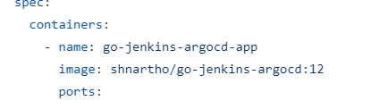
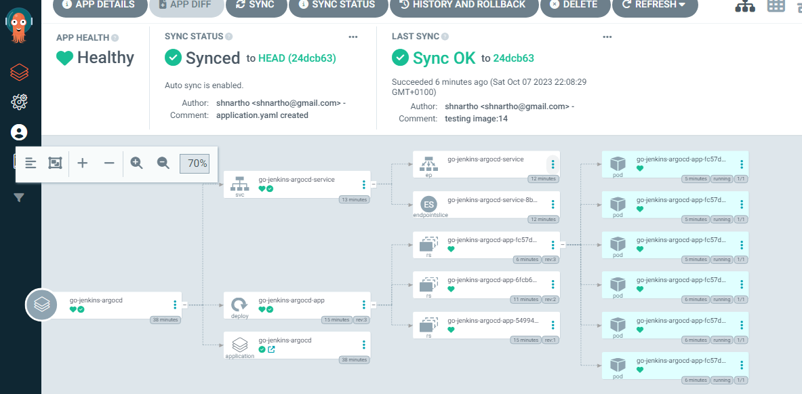

## Kubernetes-deployed web app with ArgoCD, Go backend, Nginx server, and Jenkins-powered CI/CD pipeline. ✌️

#### 🟢 In go-jenkins-argocd repo, if there is any update Jenkins job will pull repo, build docker image, push image to docker with new build number and also update the deployment.yaml file of this repository. ArgoCD will sync this repository for deployement, and as soon as this repo got updated argoCD will deploy accordingly.

#### 🟢 The application is deployed in argoCD namespace in kubernetes. This is the previous version 1.0.0 which is running.

#### 🟢 As soon as deployment.yaml file got updated with new image tag 14, argoCD will sync, pull image from dockerhub and deploy new updated container based on the image build number 14.Therefore, version 3.1.2 is now being servered by argoCD and service file is doing the load balancing and inside each container nginx is doing reverse proxy.

#### 🟢 Therefore, we have achieved complete automated CI/CD software delivery. 